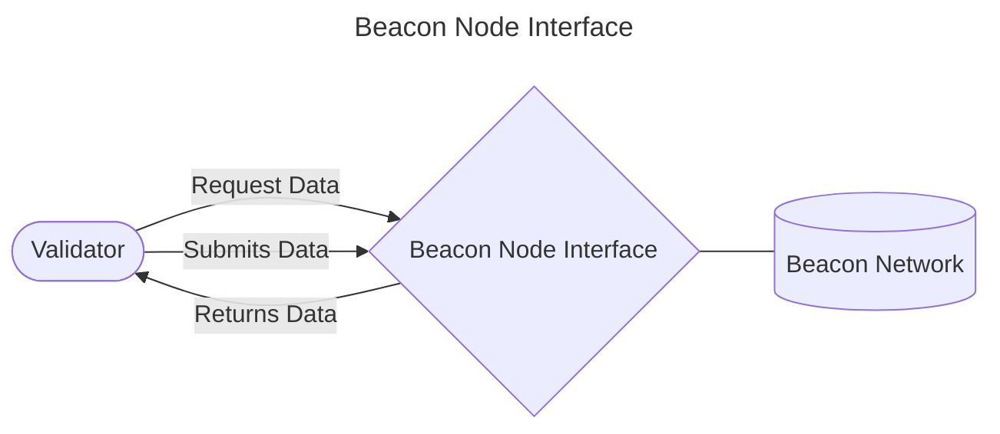

# SSV Module

This document contains the specification of the `ssv` module.

## Table of Contents

- [Beacon Node](#beaconnode)
    - [Domain Calls](#domaincalls)
    - [Proposer Calls]()
    - [Attester Calls]()
    - [Aggregator Calls]()
    - [Sync Committee Calls]()
    - [Sync Committee Contribution Calls]()
- [Runner](#runner)
    - [Runner]()
    - [Base Runner]()
        - [State]()
            - [Partial Signature Container]()
    - [Proposer Runner]()
    - [Attester Runner]()
    - [Aggregator Runner]()
    - [Sync Committee Runner]()
    - [Sync Committee Aggregator Runner]()
    - [Validator Registration Runner]()
- [Validator]()
    - [Duty runners]()

## Beacon Node

The `Beacon node interface` is a composition of all interfaces below along with a method to get a Beacon Network object.

It comprises the interface, as an API style, between the validator implementation and the Beacon Network.

It's purpose is to provide a set of functions that the validator will use to interact with the Beacon Network, both for requesting data objects, states and for submmiting signed objects to the network.

Each interface below will provide methods for getting and submitting data related to their duty's type.

### Domain Calls

`DomainCalls` is an interface with a single method *`DomainData`* used to return a signature domain.

### Proposer Calls

`ProposerCalls` is an interface used for the *Proposer duty*. It defines functions for getting Beacon blocks, blinded Beacon blocks (block with only a transaction root instead from a full transactions list) and for submitting these blocks to the node.

### Attester Calls

`AttesterCalls` is an interface for the *Attestation duty*. It defines functions for getting the attestation data and for submitting it to the node.

### Aggregator Calls

`AggregatorCalls` is an interface for the *Aggregator duty*. It has functions to get an [AggregateAndProof object](https://github.com/ethereum/consensus-specs/blob/dev/specs/phase0/validator.md#aggregateandproof), that contains:
- Aggregator index (validator index)
- aggregate attestation
- BLSSignature selection proof,

and to submit a signed aggregator message.

### Sync Committee Calls

`SyncCommitteeCalls` is an interface for the *Sync committee duty*. It has a method to get beacon blocks roots and another method to submit a signed sync committee message.

### Sync Committee Contribution Calls

`SyncCommitteeCalls` is an interface for the *Sync committee aggregator duty*. It has:
- a predicate to check if it's an aggregator,
- a function to get the subnet ID for a certain subcommittee index,
- a function to get the Contributions object and another one to submit the signed object.

## Runner

### Runner

### Base Runner

#### State

##### Partial Signatrue Container

### Proposer Runner

### Attester Runner

### Aggregator Runner

### Sync Committee Runner

### Sync Committee Aggregator Runner

### Validator Registration Runner

## Validator

### Duty runners

## Additional documents
- [Class Diagram](docs/CLASS_DIAGRAM.md)