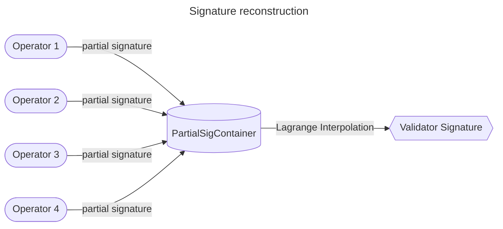
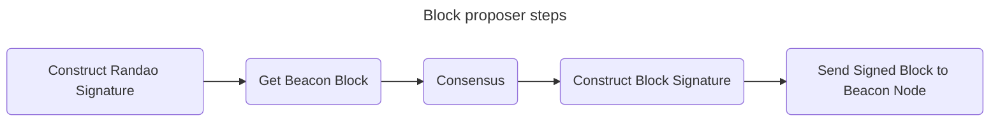
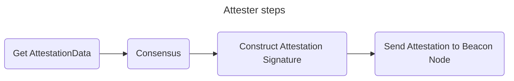
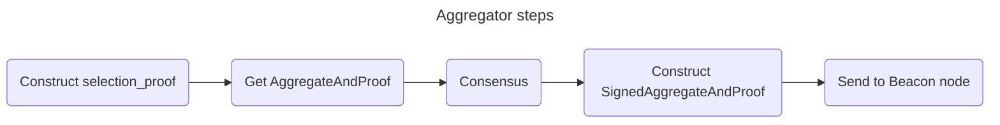
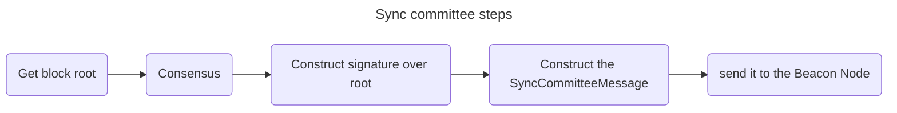
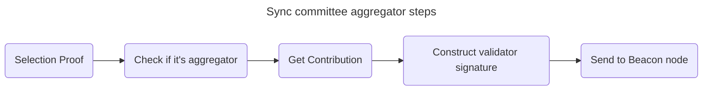
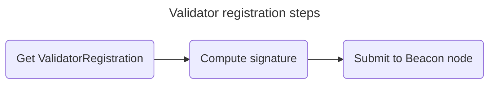

# SSV Module

This document contains the specification of the `ssv` module.

## Table of Contents

- [Beacon Node](#beacon-node)
    - [Domain Calls](#domain-calls)
    - [Proposer Calls](#proposer-calls)
    - [Attester Calls](#attester-calls)
    - [Aggregator Calls](#aggregator-calls)
    - [Sync Committee Calls](#sync-committee-calls)
    - [Sync Committee Contribution Calls](#sync-committee-aggregator-runner)
- [Runner](#runner)
    - [Runner Interface](#runner-interface)
    - [Base Runner](#base-runner)
        - [State](#state)
            - [Partial Signature Container](#partial-signature-container)
    - [Proposer Runner](#proposer-runner)
    - [Attester Runner](#attester-runner)
    - [Aggregator Runner](#aggregator-runner)
    - [Sync Committee Runner](#sync-committee-runner)
    - [Sync Committee Aggregator Runner](#sync-committee-aggregator-runner)
    - [Validator Registration Runner](#validator-registration-runner)
- [Validator](#validator)
    - [Duty runners](#duty-runners)

## Beacon Node

The `Beacon node interface` is a composition of all interfaces below along with a method to get a Beacon Network object.

It comprises the interface, as an API style, between the validator implementation and the Beacon Network.

It's purpose is to provide a set of functions that the validator will use to interact with the Beacon Network, both for requesting data objects, states and for submmiting signed objects to the network.

Each interface below will provide methods for getting and submitting data related to their duty's type.

### Domain Calls

`DomainCalls` is an interface with a single method *`DomainData`* used to return a signature domain.

### Proposer Calls

`ProposerCalls` is an interface used for the *Proposer duty*. It defines functions for getting Beacon blocks, blinded Beacon blocks (block with only a transaction root instead from a full transactions list) and for submitting these blocks to the node.

### Attester Calls

`AttesterCalls` is an interface for the *Attestation duty*. It defines functions for getting the attestation data and for submitting it to the node.

### Aggregator Calls

`AggregatorCalls` is an interface for the *Aggregator duty*. It has functions to get an [AggregateAndProof object](https://github.com/ethereum/consensus-specs/blob/dev/specs/phase0/validator.md#aggregateandproof), that contains:
- Aggregator index (validator index)
- aggregate attestation
- BLSSignature selection proof,

and to submit a signed aggregator message.

### Sync Committee Calls

`SyncCommitteeCalls` is an interface for the *Sync committee duty*. It has a method to get beacon blocks roots and another method to submit a signed sync committee message.

### Sync Committee Contribution Calls

`SyncCommitteeCalls` is an interface for the *Sync committee aggregator duty*. It has:
- a predicate to check if it's an aggregator,
- a function to get the subnet ID for a certain subcommittee index,
- a function to get the Contributions object and another one to submit the signed object.

## Runner

`Runner` is an entity responsible to perform validator duties for an operator. For that,
- it will collaborate with other operators to create signatures and
- it will count with the [Beacon node](#beacon-node) to get and send data to the blockchain.

For each duty, there is an specific runner since each duty requires a different sequence of steps, or subprotocol, to be followed by the operators.

### Runner Interface

The `Runner interface` establishes every method that a runner from any type should have. It includes functions to process pre-consensus, consensus and post-consensus method and to execute duties.

### Base Runner

The `BaseRunner` structure represents a common ground for all different types of runners. It's comprised by:
- a [state](#state),
- a *share* that contains information as its operator id, its share key, the set of operators, and [more](../types/share.go),
- a [qbft controller](../qbft/controller.go) to manage consensus instances,
- the Beacon network, its Beacon role and the highest decided slot number.

#### State

`RunnerState` stores the state of the runner during its execution. The state is composed by:
- a duty type,
- the duty decided output,
- the consensus instance that decided the output and
- [partial signature containers](#partial-signature-container) for the pre-consensus and post-consensus steps.

##### Partial Signature Container

The `PartialSigContainer` structure stores partial signatures and performs validator signature reconstruction after a quorum is reached.

The reconstruction uses Lagrange Interpolation to reconstruct a message signed with the shared secret.

This is crucial for the DVT technology, since it provides a way to construct a validator signature without any party ever having possession of the private key. This is accomplished by [Adi Shamir Secret Sharing](https://web.mit.edu/6.857/OldStuff/Fall03/ref/Shamir-HowToShareASecret.pdf) and the mathematical associative property of signing in [BLS signatures](https://www.iacr.org/archive/asiacrypt2001/22480516.pdf).

### Proposer Runner

To `propose a block`, the validator must:
- Fetch the head of the chain using the fork choice rule.
- Construct a [Beacon block](https://github.com/ethereum/consensus-specs/blob/dev/specs/phase0/beacon-chain.md#beacon-blocks).
- Sign the beacon block and broadcast it.

Block creation is abstracted by the [Beacon Node](#beacon-node) interface and the operator can just fetch the block from it.

However, there is a block field, *`randao_reveal`*, which is a signature of the validator over the epoch number. Thus, for the Beacon node to return the block, it needa to receive the signature first.

Thus the overall steps are:
1. Produce the *randao_reveal* by broadcasting and collecting partial signatures over the epoch number.
2. Send *rando_reveal* and get the Beacon block from the Beacon node interface.
3. Run consensus on the duty and block data.
3. Produce the signed Beacon block, by broadcasting and collecting partial signatures, and send it to the Beacon node.

### Attester Runner

For the `attestation duty`, the validator should construct an [AttestationData](https://github.com/ethereum/consensus-specs/blob/dev/specs/phase0/beacon-chain.md#attestationdata), which is composed by:
- a slot,
- committe index,
- a beacon block root (for the LMD GHOST vote)
- a source and target checkpoint (for the FFG vote)

and broadcast an [Attestation](https://github.com/ethereum/consensus-specs/blob/dev/specs/phase0/beacon-chain.md#attestation) to the committee subnet.

The operator can rely on the [Beacon node](#beacon-node) to get the AttestationData object.

The overall steps are:
1. Get an AttestationData from the Beacon node.
2. Reach consensus on the duty and the AttestationData.
3. Construct the validator signature for the Attestation object and send it back to the Beacon node.

### Aggregator Runner

For the `aggregator duty`, the validator must collect [AttestationData](https://github.com/ethereum/consensus-specs/blob/dev/specs/phase0/beacon-chain.md#attestationdata) from other attesters that is similar to its own created. Then, it should create an [AggregateAndProof](https://github.com/ethereum/consensus-specs/blob/dev/specs/phase0/validator.md#aggregateandproof) object, sign it and broadcast a [SignedAggregateAndProof](https://github.com/ethereum/consensus-specs/blob/dev/specs/phase0/validator.md#signedaggregateandproof) to the network.

The AggregateAndProof object can be obtained by the [Beacon node](#beacon-node). However, one of its field is the validator's signature over the slot value (*`selection_proof`*). Thus, this field must be created and delivered to the Beacon node in order to get the AggregateAndProof object.

Thus, the overall steps are:
1. Construct the validator signature over the slot value (*selection_proof*).
2. Send it to the Beacon node and request the AggregateAndProof object.
3. Do consensus over the duty and the data.
4. Construct the validator signature on the consensus output.
5. Construct the SignedAggregateAndProof object and send it to the Beacon node.

### Sync Committee Runner

On a `sync committee` duty, the validator should construct a [SyncCommitteeMessage](https://github.com/ethereum/consensus-specs/blob/dev/specs/altair/validator.md#synccommitteemessage) for the previous slot and broadcast to the sync committee subnet. The message is composed by:
- the slot,
- the beacon block root,
- the validator index,
- the validator signature over the block root.

The [Beacon node](#beacon-node) provides the beacon block root. Thus, the overall steps are:
1. Get block root from the Beacon node.
2. Do consensus on the duty and the data.
3. Construct the validator signature over the block root.
4. Creates the SyncCommitteeMessage and send it to the Beacon node.

### Sync Committee Aggregator Runner

Similarly to an attestation aggregator, a validator with a `Sync Committee Aggregator` duty should collect [SyncCommitteeMessages](#sync-committee-runner), aggregate them into a [SyncCommitteeContribution](https://github.com/ethereum/consensus-specs/blob/dev/specs/altair/validator.md#synccommitteecontribution) and send it to the network.

To know if a validator is an aggregator for the current sync committee slot, it must compute its signature over a [SyncAggregatorSelectionData](https://github.com/ethereum/consensus-specs/blob/dev/specs/altair/validator.md#syncaggregatorselectiondata) (*`selection proof`*) and use it as input of a function *[is_sync_committee_aggregator](https://github.com/ethereum/consensus-specs/blob/dev/specs/altair/validator.md)*.

Using the SyncCommitteContribution data, it constructs a [ContributionAndProof](https://github.com/ethereum/consensus-specs/blob/dev/specs/altair/validator.md#contributionandproof) message, sign it to create a [SignedContributionAndProof](https://github.com/ethereum/consensus-specs/blob/dev/specs/altair/validator.md#signedcontributionandproof) and send it to the network.

The [Beacon node](#beacon-node) provides the *is_sync_committee_aggregator* function and the ContributionAndProof object.

Thus, the operator steps for this duty are:
1. Compute the validator signature over SyncAggregatorSelectionData (*selection proof*).
2. Asks to the Beacon node if it's an aggregator. If not, stop.
3. If so, get the ContributionAndProof object with the Beacon node.
4. Compute the validator signature to create a SignedContributionAndProof and send it to the Beacon node.

> **_NOTE:_** a validator may be part of multiple sync committees and, therefore, it should check if it's an aggregator for every committee that it's part of.

### Validator Registration Runner

To `register a validator`, it needs to create the operator needs to:
1. Get the [ValidatorRegistration object](./validator_registration.go).
2. Compute the validator signature over the object.
3. Submit the validator registration to the [Beacon node](#beacon-node).

> **Warning**
> Below topics are WIP

## Validator

### Duty runners

## Additional documents
- [Class Diagram](docs/CLASS_DIAGRAM.md)